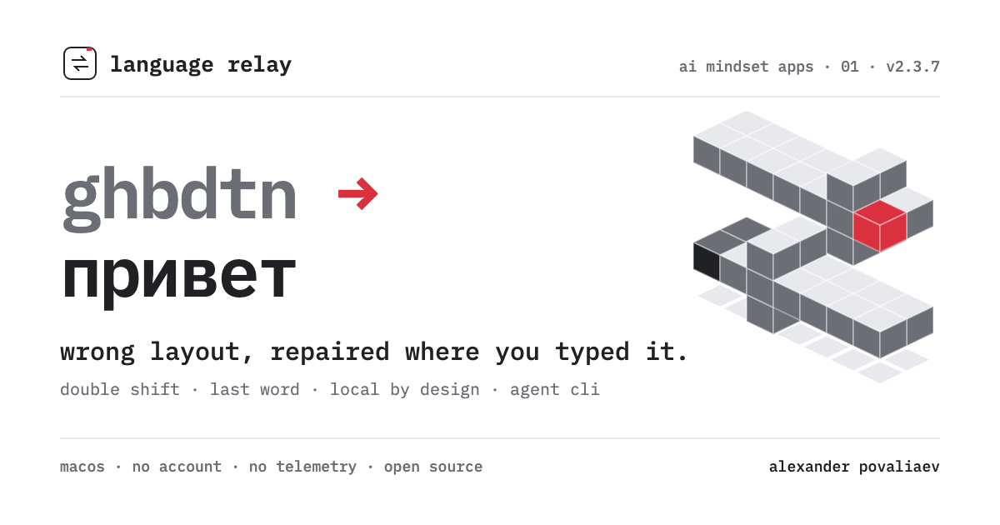

# Language Relay



**Language Relay** is a local macOS layout bridge for people and agents. It repairs text typed in the wrong layout, switches the active source, and exposes deterministic JSON commands. It belongs to **aPoWall Instruments** – focused productivity tools by Alex Povaliaev.

Current pair: `U.S.` ⇄ `Russian – PC`. Conversion, settings, and the transient typing buffer stay on the Mac. There is no telemetry, account, typed-text log, database, or runtime network request.

[Interactive website](https://apowall.github.io/language-relay/) · [Latest release](https://github.com/aPoWall/language-relay/releases/latest)

## What ships

- `⇧ ⇧` repairs the latest wrong-layout phrase or word;
- clean standalone `⌥` repairs text, or switches the layout when there is nothing to repair;
- Option with Command, Shift, Control, or another key stays untouched;
- Caps / Hyper switching can remain in Karabiner-Elements;
- Accessibility replacement is read back before success is reported;
- guarded web/Electron fallback avoids duplicated text and restores the clipboard;
- Orca and terminal inputs use a repeatable buffered path that never writes an Accessibility selection;
- preserve, sentence, uppercase, and lowercase modes;
- eight short feedback cues and four volume levels;
- menu-bar state, local diagnostics, and JSON CLI.

## Install

One command from GitHub:

```bash
npx github:aPoWall/language-relay install
```

Or build directly:

```bash
git clone https://github.com/aPoWall/language-relay.git
cd language-relay
make install
```

Installation runs setup and prints a checklist for Hammerspoon, the bridge, input sources, Accessibility, and the background app. It exits non-zero until every prerequisite is complete. Re-run it safely at any time:

```bash
language-relay setup
```

`setup` enables `U.S.` and `Russian – PC` when they are available, appends the bridge load line without changing your existing Hammerspoon configuration, and opens Accessibility settings when permission is missing. It never removes or reorders your input sources. If Hammerspoon is missing, install it with:

```bash
brew install --cask hammerspoon
```

As a manual fallback, add this once to `~/.hammerspoon/init.lua`, then reload Hammerspoon:

```lua
dofile(os.getenv("HOME") .. "/.config/language-relay/hammerspoon.lua")
```

Requirements: macOS 13+, Apple Command Line Tools, [Hammerspoon](https://www.hammerspoon.org/) with Accessibility permission, and both supported input sources enabled. Grant Accessibility to both Language Relay and Hammerspoon when macOS prompts you.

## Controls

| Module | Choices |
| --- | --- |
| Scope | Last phrase · Last word |
| Case | `aA` Preserve · `Aa` Sentence · `AA` Uppercase · `aa` Lowercase |
| Triggers | Double Shift · clean Option |
| Feedback | Pulse · Relay · Scan · Flux · Prism · Tick · Fold · Nova |
| Level | Mute 00 · Low 25 · Mid 55 · High 82 |

Given `hELLO`, the case modes produce `hELLO`, `Hello`, `HELLO`, and `hello`.

## Agent CLI

The native binary and the npm shim return stable JSON without logging input text:

```bash
language-relay convert ghbdtn
language-relay setup
language-relay status
language-relay doctor
language-relay capabilities
language-relay switch
```

Direct native surface:

```bash
"$HOME/Applications/Language Relay.app/Contents/MacOS/LanguageRelay" --convert-json ghbdtn
"$HOME/Applications/Language Relay.app/Contents/MacOS/LanguageRelay" --setup
"$HOME/Applications/Language Relay.app/Contents/MacOS/LanguageRelay" --doctor-json
"$HOME/Applications/Language Relay.app/Contents/MacOS/LanguageRelay" --capabilities-json
```

The bundle identifier and preferences domain remain `dev.alex.layout-pilot` so existing settings survive the rename.

## Gesture ownership and Karabiner

Karabiner transforms hardware events before macOS posts its virtual-keyboard output, so Language Relay can coexist with Caps / Hyper rules when those rules do not emit a clean standalone Option or Double Shift.

If another layout utility owns Double Shift or Option, keep one gesture owner active. Language Relay suspends its repair gestures when it detects a known owner and keeps menu, Caps / Hyper, and CLI access.

## Other languages

Version 2.3 supports only `U.S. ⇄ Russian – PC`. The Carbon mapping engine can be generalized to deterministic keyboard-layout pairs such as Latin/Cyrillic, Latin/Greek, or Latin/Hebrew. Same-script pairs are harder to detect, while IME, dead-key, and compose layouts need a separate architecture. The site does not claim universal language support yet.

## Build and QA

```bash
make test
make install
make integration-test
```

The default suite stays in the background: no app window, focus change, keyboard event, or sound playback. `make live-integration-test` is the separate manual lane.

## Architecture

- Swift/AppKit menu-bar app and CLI;
- Carbon `UCKeyTranslate` layout maps;
- Hammerspoon clean-modifier state machine and verified fallback;
- LaunchAgent background startup;
- vendored ShaperKit primitives;
- MIT code and documented sound provenance.

See [SECURITY.md](SECURITY.md), [ASSET-LICENSES.md](ASSET-LICENSES.md), and [CONTRIBUTING.md](CONTRIBUTING.md).
